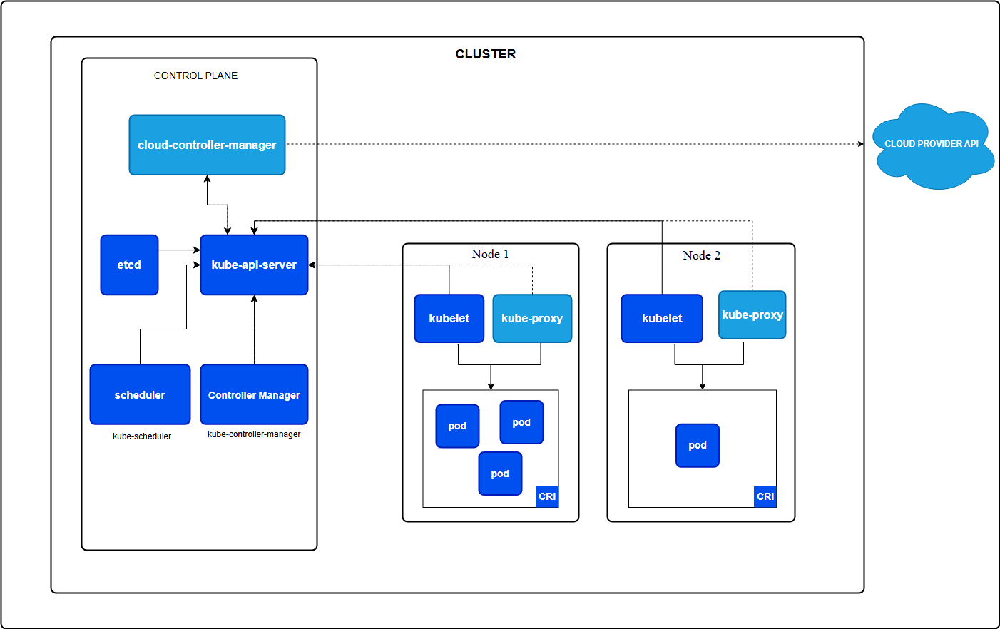
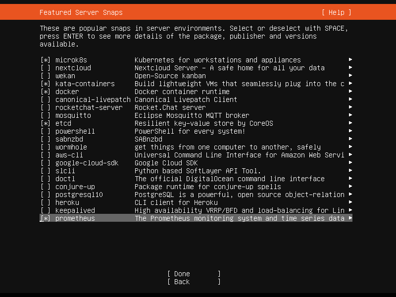
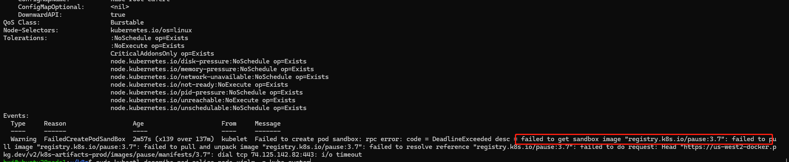

安装工具
===
在本地计算机中学习k8s无需安装所有的工具，只需要安装kubectl，minukube,kubeadm即可
# 基本工具介绍
| 工具名称     | 基本功能                                | 文档地址                                                                                     | 可安装平台 | 介绍  |
|----------|-------------------------------------|------------------------------------------------------------------------------------------|-------|-----|
| minikube |||||
| kubectl  | 用来与集群通信的命令行工具                       | [lubectl](https://kubernetes.io/zh-cn/docs/reference/kubectl/kubectl/)                   |||
| kind     | 能够在本地计算机上运行 Kubernetes              | [kind](https://kind.sigs.k8s.io/)                                                        |
| minikube | minikube 是一个工具， 能让你在本地运行 Kubernetes | [minikube](https://minikube.sigs.k8s.io/docs/)                                           |||
| kubeadm  | 可以使用 kubeadm 工具来创建和管理 Kubernetes 集群 | [kubeadm](https://kubernetes.io/zh-cn/docs/reference/setup-tools/kubeadm/)               |||
| kubelet  |                                     | [kubelet]()                                                                              |||
| kubelet  |                                     | [containerd](https://github.com/containerd/containerd/blob/main/docs/getting-started.md) |||
# minikube
## 注意
### 需要设置driver
`minikube start --driver=docker`或者先设置`minikube config set driver docker`
### 若镜像无法拉取，需要设置vpn（一般来说不用）
https://minikube.sigs.k8s.io/docs/handbook/vpn_and_proxy/
```shell
set HTTP_PROXY=http://<proxy hostname:port>
set HTTPS_PROXY=https://<proxy hostname:port>
set NO_PROXY=localhost,127.0.0.1,10.96.0.0/12,192.168.59.0/24,192.168.49.0/24,192.168.39.0/24

minikube start
```
$oldPath = [Environment]::GetEnvironmentVariable('Path', [EnvironmentVariableTarget]::Machine)
if ($oldPath.Split(';') -inotcontains 'D:\minikube'){
[Environment]::SetEnvironmentVariable('Path', $('{0};D:\minikube' -f $oldPath), [EnvironmentVariableTarget]::Machine)
}
v2ray需要以管理员方式运行，在powershell中执行`minikube start`最好也使用管理员方式    
使用minikube获取节点：` minikube kubectl -- get pods -A`
### k8s架构图

# kubelet
# kubectl
用来与集群通信的命令行工具
# kubeadm
虽然minukube、docker等工具可以在windows上运行，但kubeadm不可以，我在本地安装了一个虚拟机来实现kubeadm    
文档地址：[安装kubeadm](https://kubernetes.io/zh-cn/docs/setup/production-environment/tools/kubeadm/install-kubeadm/)      
## 容器运行时
### containerd
下载地址:[containerd](https://github.com/containerd/containerd/releases/tag/v1.7.24)    
按照以下文档的步骤依次执行：
https://github.com/containerd/containerd/blob/main/docs/getting-started.md
### 开放端口
iptables -I INPUT -p tcp --dport 6443 -j ACCEPT
## kubeadm使用阿里云镜像
kubeadm config images pull --image-repository registry.aliyuncs.com/google_containers

# 步骤
实际上我首先尝试了在windows上，联合我本地的一个ubuntu虚拟机搭建环境，无奈最终kubeadm在windows上无法安装，在虚拟机上安装内存不足，虽然我调整了内存大小，但是后续安装containerd等步骤时又再次内存不足，因此我决定从头开始。    
## 安装多个虚拟机
### 安装ubuntu
在[清华镜像源](https://mirrors.tuna.tsinghua.edu.cn)下载对应的ubuntu版本，我直接下载的非桌面版   
引导安装界面我选择了docker和etcd，其他暂时没有安装 
### 设置网络
设置网络为桥接模式，实际上还可以固定ip，但为了方便后续复制镜像暂时不固定
### 修改apt源
可以在安装过程中修改源，也可以安装后修改apt源，避免apt install超时，一定是先设置网络，保证能够使用ssh连接后再修改源，否则可能需要手输源地址了
### 选择预装
有以下这些可以预装的软件：    

我选择的预装软件有：    
microk8s    
kata-containers    
docker    
etcd    
prometheus    
### 设置共享文件夹(视需求而定，我没有这个需求暂时没设置)
执行`apt install -y gcc gcc-devel gcc-c++ gcc-c++-devel make kernel kernel-devel`安装增强工具
### 安装kubectl
1 下载kubectl，也可下载到本地然后scp到虚拟机    
`curl -LO "https://dl.k8s.io/release/$(curl -L -s https://dl.k8s.io/release/stable.txt)/bin/linux/amd64/kubectl"`    
2 安装    
`sudo install -o root -g root -m 0755 kubectl /usr/local/bin/kubectl`     
3 验证版本     
`kubectl version --client`
### 安装minikube
```shell
curl -LO https://storage.googleapis.com/minikube/releases/latest/minikube-linux-amd64
sudo install minikube-linux-amd64 /usr/local/bin/minikube && rm minikube-linux-amd64
```
执行开始：    
`minikube start --driver=docker minikube start --vm-driver=docker --image-mirror-country='cn' --image-repository='registry.cn-hangzhou.aliyuncs.com/google_containers' --logtostderr`   
#### 报错 Unable to find image 'gcr.io/k8s-minikube/kicbase
尝试改为
`minikube start --driver=docker --driver='docker' --image-mirror-country='cn' --logtostderr`
#### 报错temporary error: container minikube status is  but expect it to be exited
```
docker pull registry.cn-hangzhou.aliyuncs.com/google_containers/storage-provisioner:v5
docker tag registry.cn-hangzhou.aliyuncs.com/google_containers/storage-provisioner:v5 registry.cn-hangzhou.aliyuncs.com/google_containers/k8s-minikube/storage-provisioner:v5
docker images -a
minikube cache add registry.cn-hangzhou.aliyuncs.com/google_containers/k8s-minikube/storage-provisioner:v5

```
再次启动


# 异常情况记录
## kubectl出现错误：The connection to the server localhost:8080 was refused - did you specify the right host or port?
（1）可能是k8s未启动，`sudo microk8s start`
（2）可能是没有安装kubelet或者kubelet未启动，执行`sudo snap install kubelet`    
（3）也可能是没有init,先安装kubeadm`sudo snap install kubeadm --classic`,再以root用户执行`kubeadm init`
设置别名:`sudo snap alias microk8s.kubectl kubectl`
此时再执行
## 生成token
```yaml
apiVersion: v1
kind: Secret
metadata:
  name: admin-user
  namespace: kube-system
  annotations:
    kubernetes.io/service-account.name: "admin-user"
type: kubernetes.io/service-account-token
```
我使用的以上yaml文件生成的token:` sudo kubectl get secret admin-user -n kube-system -o jsonpath={".data.token"} | base64 -d`    
此时就能获取到当前节点了:`kubectl get nodes`
## kubelet报错：[core] [Channel #1 SubChannel #2]grpc: addrConn.createTransport failed to connect to {Addr: "/run/containerd/containerd.sock", ServerName: "localhost", }. Err: connection error: desc = "transport: Error while dialing: dial unix /run/containerd/containerd.sock: connect: no such file or directory
没有安装containerd导致的，`sudo apt install containerd`   
## kubelet报错：failed to run Kubelet: running with swap on is not supported, please disable swap or set --fail-swap-on flag to false
意味着 Kubernetes 不支持在启用交换空间（swap）时运行，Kubelet 强烈要求禁用交换空间    
`sudo vim /etc/fstab`注释掉与swap相关的行，执行`sudo swapoff -a`禁止交换    
## kubelet报错：Failed to listen and serve" err="listen tcp 0.0.0.0:10250: bind: address already in use
通过查看`sudo lsof -i :10250`发现是kubelite占用的，直接卸载kubelet    
查看`sudo systemctl status snap.microk8s.daemon-kubelite`kubelite状态
## sudo kubectl get nodes状态为NotReady
通过执行`sudo kubectl describe node xxx(xxx指的是服务器名，例如localhost)`发现Conditions有一个报错：    
` container runtime network not ready: NetworkReady=false reason:NetworkPluginNotReady`    
检查节点状态：`kubectl get pods --all-namespaces`,发现有个calico-node-xjplr 的 status是Init:0/2    
执行：`sudo kubectl describe pod calico-node-xjplr -n kube-system`发现节点状态异常，报错：    

直接设置sandbox_image，一般来说这个配置在/etc/containerd/config.toml里面，但是我用的microK8s，修改/var/snap/microk8s/current/args/kubelet，添加一行：    
`--sandbox-image=registry.aliyuncs.com/google_containers/pause:3.6`,重启：
```shell
sudo microk8s.stop
sudo microk8s.start
```
## 报错：Failed to get lease: leases.coordination.k8s.io "ubuntu20node1" not found
节点未加入集群，执行：sudo microk8s.add-node
